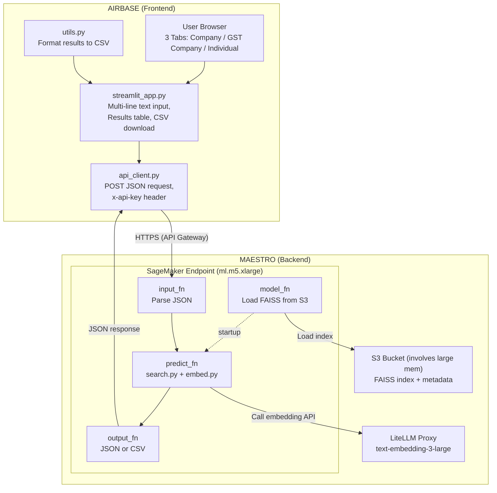
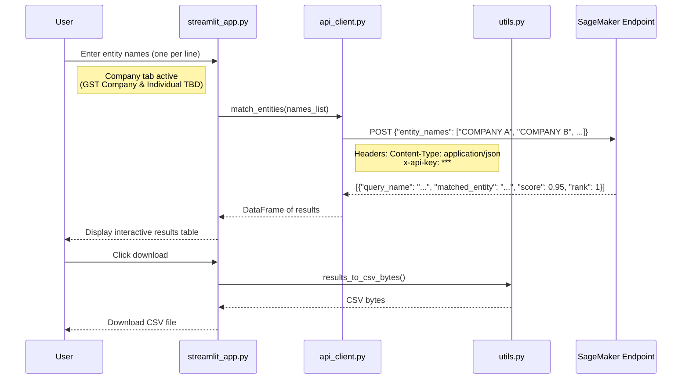

# GST Entity Matcher

Match company names against ~1.8M GST-registered entities in Singapore using embedding-based similarity search (FAISS + OpenAI text-embedding-3-large).

## Architecture



### Airbase Request Flow



## Project Structure

```
gst-registrants/
│
├── app/                        # Streamlit frontend (deployed on Airbase)
│   ├── streamlit_app.py        # Main app — Company / GST Company / Individual tabs
│   ├── api_client.py           # HTTP client → SageMaker endpoint via API Gateway
│   ├── utils.py                # CSV parsing, column detection, results formatting
│   └── requirements.txt        # Slim deps (streamlit, pandas, requests — no FAISS)
│
├── endpoint/                   # SageMaker endpoint (deployed on MAESTRO)
│   ├── inference.py            # model_fn, input_fn, predict_fn, output_fn
│   └── package_model.py        # Bundle code + deps into model.tar.gz for S3
│
├── indexing/                   # One-time job: embed all entities + build FAISS index
│   ├── embed.py                # Batched API calls to text-embedding-3-large
│   ├── build_index.py          # Build FAISS IndexFlatIP, save to S3
│   └── run_indexing.py         # Orchestrator: load CSV → embed → index → upload
│
├── matching/                   # Query-time logic (runs inside SageMaker endpoint)
│   ├── search.py               # Load FAISS index, embed query, return top-k
│   └── pipeline.py             # match_entities() — single entry point
│
├── notebooks/                  # MAESTRO JupyterLab notebooks
│   ├── 01_explore_data.ipynb   # Explore GST entity data from S3
│   ├── 02_run_indexing.ipynb   # Run embedding + indexing pipeline
│   ├── 03_test_matching.ipynb  # Test queries against the index
│   └── 04_deploy_endpoint.ipynb# Register + deploy SageMaker endpoint
│
├── tests/
│   ├── test_embed.py
│   └── test_search.py
│
├── config.py                   # Shared config (S3 paths, model, thresholds)
├── requirements.txt            # Full deps (MAESTRO / SageMaker endpoint)
├── Dockerfile                  # Airbase container image
├── airbase.json                # Airbase project config
├── .gitlab-ci.yml              # CI/CD pipeline (auto-deploy to Airbase)
├── .env.example                # Template for environment variables
└── .gitignore
```

## Deployment

### Airbase (Frontend)

Deploys automatically via GitLab CI/CD when you push to the default branch.

**Runtime env vars** (set via `AIRBASE_ENV_LOCAL_FILE` CI/CD variable):
| Variable | Description |
|----------|-------------|
| `SAGEMAKER_ENDPOINT_URL` | API Gateway URL from MAESTRO |
| `SAGEMAKER_API_KEY` | API key from MAESTRO API Gateway |

### MAESTRO (Backend)

Deploy via `notebooks/04_deploy_endpoint.ipynb`:
1. Package model artifacts → upload `model.tar.gz` to S3
2. Register Model Package (with env vars for OpenAI keys, TorchServe config)
3. Approve in MAESTRO UI
4. Deploy endpoint (ml.m5.xlarge, 1 worker)
5. Attach to API Gateway in MAESTRO UI

**Container env vars** (set in Model Package, Step 5):
| Variable | Description |
|----------|-------------|
| `OPENAI_API_KEY` | From MAESTRO JupyterLab environment |
| `OPENAI_API_BASE` | LiteLLM proxy URL |
| `SAGEMAKER_TS_RESPONSE_TIMEOUT` | TorchServe model-load timeout (600s) |
| `SAGEMAKER_MODEL_SERVER_WORKERS` | Number of TorchServe workers (1) |

## Development Workflow

1. **Explore data** — `notebooks/01_explore_data.ipynb`
2. **Build index** — `notebooks/02_run_indexing.ipynb` (embed all entities, ~20 min)
3. **Test matching** — `notebooks/03_test_matching.ipynb`
4. **Deploy endpoint** — `notebooks/04_deploy_endpoint.ipynb`
5. **Deploy frontend** — push to default branch → CI/CD auto-deploys to Airbase
